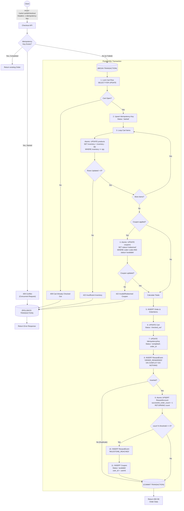

# E-Commerce Checkout API Documentation

This document outlines the REST API endpoints provided by the backend service. All endpoints (except where explicitly public) require an `Authorization: Bearer <token>` header, though for local testing, the backend will automatically mock a demo user if the header is missing.

## Table of Contents
- [Products API](#products-api)
- [Carts API](#carts-api)
- [Checkout API](#checkout-api)
- [Rewards & Coupons API](#rewards--coupons-api)
- [Admin API](#admin-api)

---

## Products API

### `GET /products`
Retrieve a list of all available products in the catalog.

**Response:** `200 OK`
```json
{
  "data": [
    {
      "id": "p-1",
      "name": "Mechanical Keyboard",
      "unitPriceMinor": 12999,
      "currency": "USD",
      "inventory": 50
    }
  ]
}
```

---

## Carts API

### `POST /carts`
Get the current user's active (open) cart, or create a new one if none exists.

**Response:** `200 OK`
```json
{
  "data": {
    "id": "cart_123",
    "status": "OPEN",
    "items": []
  }
}
```

### `GET /carts/:cartId`
Retrieve a specific cart and its items.

**Response:** `200 OK`

### `POST /carts/:cartId/items`
Add a product to the cart.

**Request Body:**
```json
{
  "productId": "p-1",
  "quantity": 1
}
```
**Response:** `201 Created`

### `PATCH /carts/:cartId/items/:productId`
Update the quantity of an existing item in the cart.

**Request Body:**
```json
{
  "quantity": 2
}
```
**Response:** `200 OK`

### `DELETE /carts/:cartId/items/:productId`
Remove an item from the cart entirely.

**Response:** `200 OK`

---

## Checkout API

### `POST /carts/:cartId/checkout`
Checkout the active cart. Deducts inventory, consumes any applied coupons, creates an order, updates idempotency status, and provisions reward milestones.

**Headers:**
- `x-idempotency-key` (string, required): A unique key to prevent duplicate checkouts.

**Request Body:**
```json
{
  "paymentMethodId": "pm_card_visa",
  "couponCode": "REWARD-123" // Optional
}
```

**Response:** `200 OK`
```json
{
  "data": {
    "id": "order-123",
    "grossAmountMinor": 12999,
    "discountAmountMinor": 1299,
    "netAmountMinor": 11700,
    "status": "paid"
  }
}
```

### Checkout Architecture & Database Flow Diagram
The checkout process is heavily protected against concurrency, deadlocks, and idempotency failures. The following diagram maps exactly how the PostgreSQL transaction is structured.



---

## Rewards & Coupons API

### `GET /me/rewards`
Returns the authenticated user's current progress towards the next milestone, as well as an immutable ledger of all historical reward events.

**Response:** `200 OK`
```json
{
  "data": {
    "progress": 8,
    "history": [
      {
        "orderId": "order-123",
        "eventType": "MILESTONE_REACHED",
        "milestone": 5,
        "createdAt": "2026-09-14T15:00:00Z"
      }
    ]
  }
}
```

### `GET /me/coupons`
Returns all currently `available` coupons that are scoped exclusively to the authenticated user.

**Response:** `200 OK`
```json
{
  "data": [
    {
      "id": "c-123",
      "code": "REWARD-12345-5-AB12",
      "discountType": "percentage",
      "discountValue": 10,
      "status": "available",
      "userId": "user-uuid"
    }
  ]
}
```

---

## Admin API

### `POST /admin/coupons/generate`
Generates a global coupon based on a milestone interval across the entire store's purchase history. 

**Request Body:**
```json
{
  "milestoneInterval": 100,
  "discountType": "percentage",
  "discountValue": 15
}
```

### `GET /admin/report`
Generates a financial accounting report that correctly rolls up sales, discounts, net revenue, and coupon utilization strictly based on historical transaction snapshots.

**Response:** `200 OK`
```json
{
  "data": {
    "totalOrders": 100,
    "grossRevenue": 1500000,
    "totalDiscounts": 10000,
    "netRevenue": 1490000,
    "itemSales": [...],
    "coupons": {
      "generated": 10,
      "available": 5,
      "redeemed": 5
    }
  }
}
```
