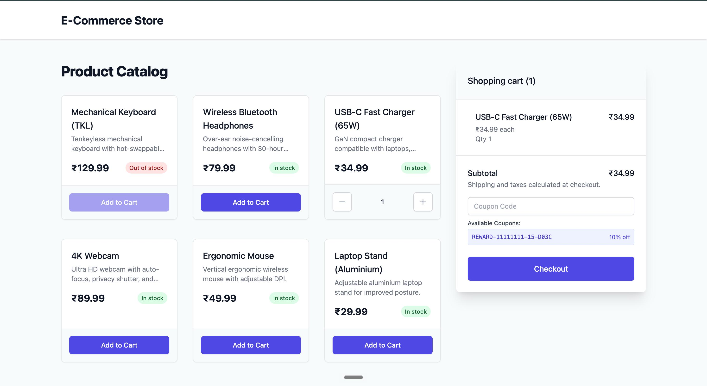

# E-Commerce Checkout & Rewards Service



A robust, full-stack E-Commerce checkout application focused on **ACID-compliant transactions**, **concurrency control**, **idempotency**, and a reliable **rewards milestone system**.

## Architecture Highlights
- **Atomic Transactions:** The checkout process is wrapped in a PostgreSQL transaction that locks carts, safely decrements inventory, redeems coupons, creates orders, and generates reward events.
- **Idempotency:** A dedicated `IdempotencyKey` table and constraints prevent double-charges and race conditions caused by network retries or concurrent clicks.
- **Reward Milestones:** Every successful order bumps an atomic progress counter (`RewardAccount`), and hitting a configured threshold automatically generates an immutable `RewardEvent` and user-scoped `Coupon`.
- **E2E Integration:** Full UI-to-DB integration testing using `Playwright` for UI flows and `Vitest` for rigorous backend concurrency failure-injection.

---

## Prerequisites
- Node.js (v20+)
- PostgreSQL (running locally or via Docker)

---

## Backend Setup (`/be`)

The backend is built with Node.js, Express, Sequelize (PostgreSQL), and Serverless Framework (Offline).

1. **Install Dependencies:**
   ```bash
   cd be
   npm install
   ```

2. **Database Configuration:**
   Copy the example environment file and configure your PostgreSQL credentials if they differ from the defaults.
   ```bash
   cp .env.example .env
   ```
   *(Ensure your PostgreSQL server is running and accessible).*

3. **Initialize Database:**
   Run the setup script which automatically drops, migrates, and seeds the database with initial products.
   ```bash
   npm run db:reset
   ```

4. **Start the API Server:**
   ```bash
   npm run dev
   ```
   *The API will be available at `http://localhost:8000`.*

5. **Run the Test Suite:**
   The test suite includes robust unit tests, concurrency load tests, and transaction rollback tests.
   ```bash
   npm test
   ```

---

## Frontend Setup (`/web`)

The frontend is a React application built with Vite, TailwindCSS, and Redux Toolkit.

1. **Install Dependencies:**
   ```bash
   cd web
   npm install
   ```

2. **Start the Development Server:**
   ```bash
   npm run dev
   ```
   *The UI will be available at `http://localhost:5173`.*

---

## API Documentation & Architecture

For full details on the REST API endpoints and a detailed **Mermaid Flowchart** of the atomic checkout database transaction, please read the [API.md](./API.md) documentation.

For a deeper dive into the architectural decisions regarding concurrency locks, the immutable reward history ledger, and idempotency, review the [DECISIONS.md](./DECISIONS.md) log.
